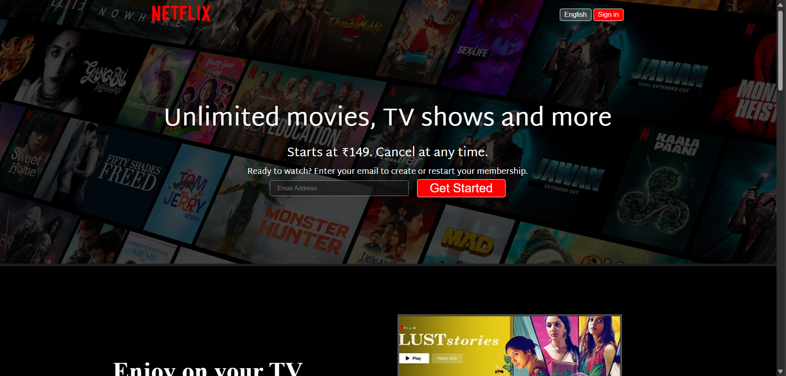
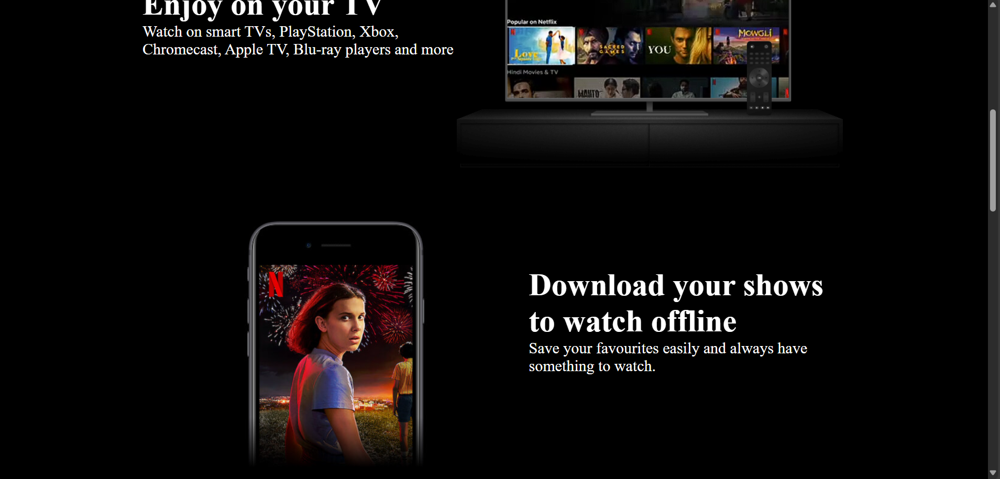
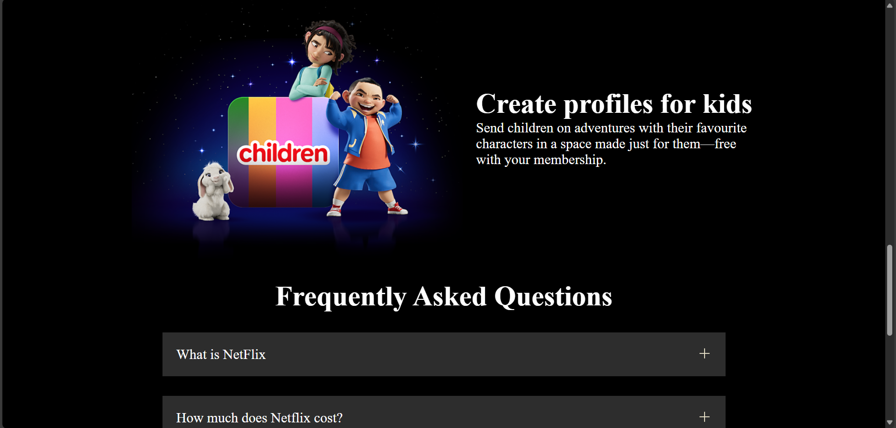

# Netflix Clone

A responsive Netflix clone website built with HTML and CSS, featuring a modern UI design that closely resembles the original Netflix platform. This project demonstrates front-end development skills and responsive web design principles.

## Features

- **Responsive Design**
  - Adapts to various screen sizes (mobile, tablet, desktop)
  - Fluid layouts using CSS Grid and Flexbox
  - Media queries for optimal viewing experience

- **Hero Section**
  - Full-screen background image with overlay
  - Dynamic heading and subheading
  - Email subscription form
  - Call-to-action button

- **Content Sections**
  - TV watching experience with embedded video
  - Download functionality showcase
  - Multi-device support demonstration
  - Kids profile creation feature

- **Interactive Elements**
  - FAQ section with hover effects
  - Language selector dropdown
  - Sign-in button
  - Navigation menu

- **Footer**
  - Comprehensive navigation links
  - Contact information
  - Multiple column layout
  - Responsive grid system

## Project Structure

```
Netflix_clone/
├── assets/
│   ├── images/
│   │   └── bg.jpg (Hero section background)
│   └── videos/
│       └── (Video assets for feature sections)
├── index.html (Main HTML file)
├── style.css (All styling and responsive design)
├── logo.svg (Netflix logo)
├── favicon.ico (Website icon)
└── screenshots/
    └── (Project screenshots)
```

## Technologies Used

- **Frontend**
  - HTML5 (Semantic markup)
  - CSS3 (Modern styling)
  - Google Fonts (Martel Sans, Montserrat)
  - SVG (Scalable vector graphics)

- **Design Features**
  - CSS Grid and Flexbox
  - Media Queries
  - CSS Variables
  - Responsive Images
  - CSS Transitions

## Key Components

1. **Navigation Bar**
   - Netflix logo (SVG format)
   - Language selector with dropdown
   - Sign-in button with hover effects
   - Responsive design for mobile view

2. **Hero Section**
   - Full-width background image
   - Dark overlay for better text visibility
   - Centered content with responsive text
   - Email input form with validation
   - Get Started button with hover effects

3. **Feature Sections**
   - TV watching experience
     - Embedded video demonstration
     - Responsive image placement
   - Download functionality
     - Mobile device showcase
     - Feature description
   - Multi-device support
     - Device compatibility list
     - Cross-platform demonstration
   - Kids profile creation
     - Child-friendly interface preview
     - Parental control features

4. **FAQ Section**
   - Interactive accordion-style questions
   - Hover effects on questions
   - Common Netflix-related queries
   - Smooth transitions

5. **Footer**
   - Contact information
   - Multiple navigation columns
   - Responsive grid layout
   - Social media links
   - Legal information

## Responsive Design Details

The website implements responsive design through:

- **Media Queries**
  - Breakpoints at 1300px for desktop
  - Mobile-first approach
  - Flexible layouts

- **Flexible Layouts**
  - CSS Grid for footer
  - Flexbox for navigation
  - Responsive image sizing
  - Fluid typography

- **Performance Optimization**
  - Optimized images
  - Efficient CSS selectors
  - Minimal JavaScript
  - Fast loading times

## Getting Started

1. **Prerequisites**
   - Modern web browser
   - Basic understanding of HTML/CSS

2. **Installation**
   ```bash
   git clone [repository-url]
   cd Netflix_clone
   ```

3. **Running the Project**
   - Open `index.html` in your web browser
   - No build process required
   - No dependencies to install

## Screenshots

### Desktop View


### Mobile View


### Feature Sections


### FAQ Section


## Future Improvements

- **Technical Enhancements**
  - Add JavaScript functionality
  - Implement user authentication
  - Add content filtering
  - Improve accessibility

- **Feature Additions**
  - Dark/Light mode toggle
  - User profiles
  - Content recommendations
  - Search functionality

- **Performance**
  - Lazy loading for images
  - Code splitting
  - Performance optimization
  - Better caching

## Credits

- Design inspired by Netflix
- Images and videos from Netflix assets
- Fonts from Google Fonts
- Icons from Material Design

## License

This project is created for educational purposes only. All Netflix-related assets and trademarks belong to Netflix, Inc.
